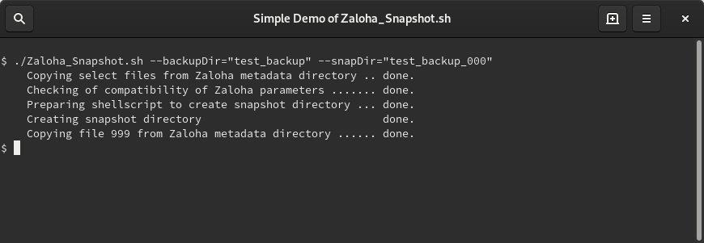

# Zaloha_Snapshot.sh

Zaloha_Snapshot is an add-on script to [Zaloha](https://github.com/Fitus/Zaloha.sh) to create hardlink-based snapshots
of the backup directory *(condition: hardlinks must be supported by the
underlying filesystem type)*.

This allows to create **Time Machine**-like backup solutions.

Zaloha_Snapshot has been created using the same technology and style as [Zaloha](https://github.com/Fitus/Zaloha.sh)
itself. Read [Zaloha documentation](https://github.com/Fitus/Zaloha.sh/blob/master/DOCUMENTATION.md) to get acquainted with relevant terminology,
features, cautions and limitations.

Documentation is available both [online](DOCUMENTATION.md) as well as inside of Zaloha_Snapshot.sh.

On Linux/Unics, Zaloha_Snapshot runs natively. On Windows, Cygwin is needed.

## Usage Example

```bash
Zaloha_Snapshot.sh --backupDir="test_backup" --snapDir="test_backup_000" [other options, see docu]
```

## Usage Screenshot


## License
MIT License
